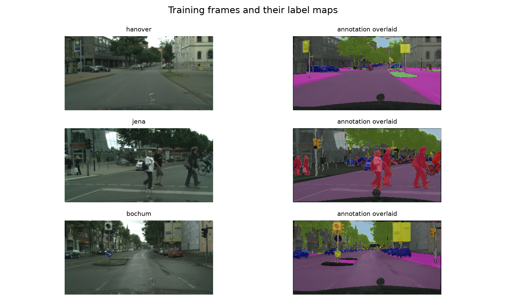

# Assignment 2 dataset proposal

Semantic segmentation on Cityscapes. Every number below is measured, not quoted.

## Dataset

| Field | Value |
| --- | --- |
| Name | Cityscapes, fine annotations |
| Source | https://www.cityscapes-dataset.com, packages `leftImg8bit_trainvaltest` and `gtFine_trainvaltest` |
| Version | Current release of the fine-annotation packages, fetched 7 October 2026 |
| License | Non-commercial research and educational use, account required |

## Task, input, output

Dense per-pixel classification of street scenes. Input is one RGB frame at 1024×2048; output assigns each pixel one of 19 classes, or the ignore label where no evaluated class applies.

## Samples and annotation types

5,000 finely annotated frames at 1024×2048, annotated as per-pixel polygons: 2,975 in the official train split across 18 cities, 500 in val across 3, and 1,525 in test across 6 whose labels are withheld.

Three training frames and their label maps. Dark regions carry the ignore label: the bonnet of the recording vehicle along the bottom of every frame, and the rectification border at its edges.

## Preliminary distribution analysis

Over all 2,406 images of our training partition. 11.8% of pixels carry no evaluated label. The last column samples one random 512×512 crop per image, which is what a training batch sees.

| Class | Pixels | In images | Area when present | In a 512 crop |
| --- | ---: | ---: | ---: | ---: |
| road | 36.799% | 98% | 33.562% | 93% |
| building | 22.915% | 99% | 20.162% | 82% |
| vegetation | 16.071% | 97% | 13.148% | 71% |
| car | 6.784% | 95% | 4.179% | 71% |
| sidewalk | 6.160% | 94% | 4.665% | 79% |
| sky | 3.880% | 90% | 2.966% | 25% |
| person | 1.319% | 79% | 0.517% | 46% |
| pole | 1.173% | 99% | 0.828% | 77% |
| terrain | 1.119% | 55% | 0.600% | 30% |
| fence | 0.921% | 43% | 0.809% | 19% |
| wall | 0.741% | 36% | 0.685% | 17% |
| traffic sign | 0.559% | 94% | 0.307% | 47% |
| bicycle | 0.385% | 54% | 0.231% | 26% |
| truck | 0.309% | 12% | 0.446% | 4% |
| bus | 0.222% | 9% | 0.664% | 4% |
| train | 0.208% | 4% | 0.912% | 2% |
| traffic light | 0.199% | 54% | 0.183% | 23% |
| rider | 0.127% | 33% | 0.131% | 13% |
| motorcycle | 0.108% | 18% | 0.131% | 6% |

Road, building and vegetation occupy 75.8% of evaluated pixels, so predicting only those three already reaches about 0.76 pixel accuracy. mIoU averages across classes and will not hide the other sixteen.

Scarcity takes two forms. Poles cover 1.17% of pixels but appear in 99% of images and traffic signs 0.56% in 94%: thin structures lost to boundary imprecision. Trains cover 0.21% in 4% of images and buses 0.22% in 9%, yet occupy 0.91% and 0.66% of a frame when visible: large but rarely seen. Cropping sharpens the second form, taking trains to 2% of crops and sky from 90% of images to 25%. One remedy will not fix both, which is what makes the loss comparison worth running.

The ego vehicle and the rectification border make 7.7% of every frame unusable regardless of content, so the loss carries `ignore_index=255`.

Per-channel normalization, training partition only: mean 0.288, 0.325, 0.285 and standard deviation 0.186, 0.188, 0.185.

## Data-splitting plan and split unit

**The split unit is the city.** The official partitions share no city, so frames from one street cannot sit on both sides. Test labels are withheld, so the official validation split becomes our test set; choosing a checkpoint on it would be selection on the test set, so the cities that choose it come out of train instead.

| Our partition | Source | Cities | Images |
| --- | --- | ---: | ---: |
| train | official train | 15 | 2,406 |
| val | official train, held out by seed | 3 | 569 |
| test | official val | 3 | 500 |

Seed 0 holds out Bremen, Cologne and Krefeld. No subset selection rules: the full fine-annotation set is used.

## Evaluation metrics

mIoU as primary and Dice as secondary, from a running confusion matrix. Per-class IoU is reported alongside the mean, which alone cannot show which of the two kinds of scarcity a change addresses.

## Baseline and pretrained model

The baseline is a U-Net written from scratch: symmetric encoder and decoder, skip connections, base width 32, depth 4, no pretrained weights. The pretrained model is torchvision's DeepLabV3 with an ImageNet-pretrained MobileNetV3-Large backbone and a 19-class head replacing the original classifier.

Fine-tuning: train every parameter with AdamW at 3e-4 and cosine annealing over 40 epochs, selecting on validation mIoU with early stopping after 8 epochs.

The controlled experiment is **frozen versus fully fine-tuned backbone**, with cross-entropy against Dice and MobileNetV3 against ResNet50 as further factors if the budget allows.

| Component | Origin |
| --- | --- |
| U-Net, Dice loss, mIoU and Dice metrics | Written from scratch in PyTorch |
| DeepLabV3 | `torchvision.models.segmentation` |
| Cross-entropy, data loading, augmentation | `torch.nn`, `torch.utils.data`, `torchvision.transforms` |
| Label remapping, download | `cityscapesscripts` |

## Compute estimate

Measured by `notebooks/compute.ipynb` on an Apple M4 Pro, 14 cores, 48 GB, at batch size 8 and 301 steps per epoch.

| Configuration | Crop | Trainable | Per step | 40 epochs | ms/image at batch 1 | ms/image at batch 8 |
| --- | ---: | ---: | ---: | ---: | ---: | ---: |
| U-Net, base width 32, depth 4 | 512 | 7.8M | 0.73 s | 2.4 h | 22.9 | 22.5 |
| U-Net, base width 32, depth 4 | 384 | 7.8M | 0.41 s | 1.4 h | 13.7 | 12.5 |
| U-Net, base width 64, depth 4 | 512 | 31.0M | 2.05 s | 6.9 h | 70.4 | 69.6 |
| DeepLabV3-MobileNetV3-Large | 512 | 11.0M | 0.25 s | 0.8 h | 14.9 | 8.1 |
| DeepLabV3-MobileNetV3-Large | 384 | 11.0M | 0.15 s | 0.5 h | 11.9 | 5.4 |
| DeepLabV3-ResNet50 | 512 | 39.6M | 1.73 s | 5.8 h | 73.0 | 71.6 |
| DeepLabV3-ResNet50, backbone frozen | 512 | 16.1M | 0.81 s | 2.7 h | 72.7 | 71.3 |

At base width 32 the baseline holds 7.8M parameters against the pretrained model's 11.0M, so a difference between them is attributable to architecture and pretraining rather than capacity; base width 64 is listed to show that the alternative would have made the baseline the heaviest model in the comparison. MobileNetV3 is 7 times cheaper per step than ResNet50, which is what keeps the schedule comfortable.

Planned budget at the 512 crop: U-Net at three seeds, 7.3 h; DeepLabV3-MobileNetV3 at three seeds, 2.5 h; the freeze pair, 0.8 h; one ResNet50 run, 5.8 h. **16.4 GPU-hours** against 35 days, on the local machine. A 384 crop halves it if needed, and resolution is itself one of the controlled factors section 20 lists.

Storage is 11 GB of images and 808 MB of labels, plus 11.3 GB of archives that can be deleted once unpacked.

## Reuse in Assignment 3

Cityscapes carries a second modality for the same frames: `disparity_trainvaltest` provides a disparity map per image, which converts to metric depth with the camera parameters in `camera_trainvaltest`. RGB paired with depth over an identical frame list is a valid cross-modal pairing, and the city split carries over unchanged.
